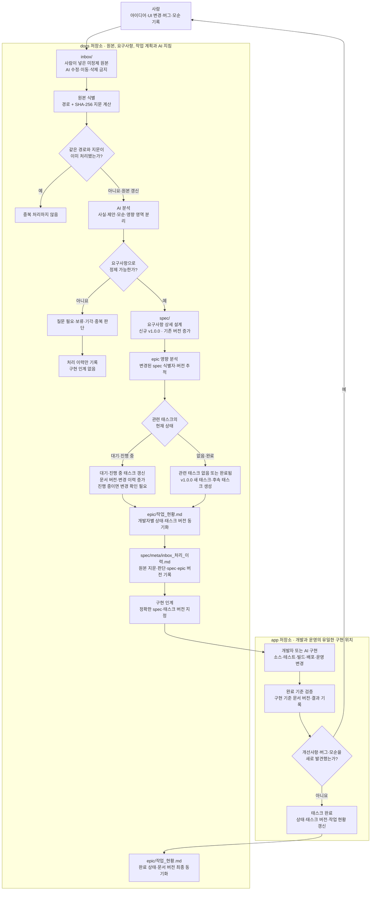

# yaki-season 문서 저장소

이 저장소는 yaki-season 게임 개발을 위한 아이디어 수집, 요구사항 정의, AI 개발 지침, 개발자별 작업 분해 문서를 관리한다.

게임 개발과 운영에 필요한 소스코드, 테스트, 빌드·배포 설정은 별도 `app` 저장소에서만 관리한다.

## 디렉토리 구조

- `inbox/`: 사람이 직접 넣은 정제되지 않은 원본 데이터(raw data)를 그대로 보관한다.
- `spec/`: AI가 `inbox/` 원본을 분석·정제한 요구사항 상세 설계를 카테고리별로 관리한다.
- `template/`: AI 개발 지침서와 반복 사용 가능한 문서 템플릿을 보관한다.
- `epic/`: `spec/`을 기반으로 PM·개발자·Artist·통합 QA 역할이 독립적으로 수행할 작업과
  스테이지별 병렬·순차 인계를 태스크 문서로 관리한다.
- `terminal-guides/`: 컴퓨터·터미널·대화 세션이 바뀌어도 PM·개발자·Artist가 직전 작업에서
  재개하기 위한 역할별 최초 지침과 handoff 기록을 관리한다.

역할별 터미널을 새로 열 때는
[terminal-guides/README.md](terminal-guides/README.md)의 공통 부팅 절차를 먼저 실행한다.

## 전체 파이프라인

### 단계별 관리 기준

| 단계 | 기록 주체 | 관리 위치 | 핵심 기준 |
|---|---|---|---|
| 원본 입력 | 사람 | `inbox/`, `inbox/99.change-request/` | 정제하지 않은 원본을 그대로 보관하고 AI는 수정하지 않음 |
| 원본 판별 | AI | `spec/meta/inbox_처리_이력.md` | 경로와 SHA-256 지문으로 신규·갱신·중복 원본 구분 |
| 요구사항 정제 | AI | 카테고리별 `spec/` | 관련 요구사항 식별자를 갱신하거나 새 요구사항 생성 |
| 작업 계획 | AI | `epic/pm-orchestration/`, `epic/developer-1/`, `epic/developer-2/`, `epic/developer-3/`, `epic/artist/`, `epic/qa-release/` | 요구사항 식별자를 참조하고 기존 태스크 갱신 또는 새 태스크 생성 |
| 작업 현황 | AI | `epic/작업_현황.md` | 개발자별 진행·대기·보류·완료 상태 동기화 |
| 구현·검증 | 개발자 또는 AI | `app` 저장소 | 지정된 spec·태스크를 기준으로 구현하고 검증 결과 기록 |
| 재입력 | 사람 | `inbox/99.change-request/` | 구현 중 발견한 개선사항·버그·모순을 새 원본으로 기록하여 순환 재개 |

세부 절차는 `template/AI_변경사항_반영_파이프라인.md`를 따른다. 문서 이력·버전은 git이 단일 원본이며 문서 본문에 수동 버전·변경 이력을 유지하지 않는다.

## 작성 원칙

- 모든 문서, 예제, 가이드, 커밋 메시지는 한국어로 작성한다.
- `inbox/` 원본은 이동하거나 수정하지 않는다. AI가 필요한 내용을 추출·정제해 `spec/`에 별도로 반영한다.
- 새 `spec/`·`epic/` 문서는 `v1.0.0`으로 시작하며, 기존 문서 변경 시 버전과 변경 이력을 반드시 갱신한다.
- `epic/`의 작업은 반드시 관련 `spec/` 문서를 참조해야 한다.
- 구현과 운영은 `app` 저장소에서만 수행한다.
- 저장소 전역 AI 작업 규칙은 `AGENTS.md`를 따른다.
