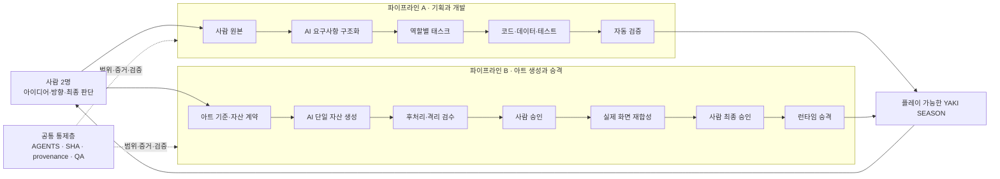
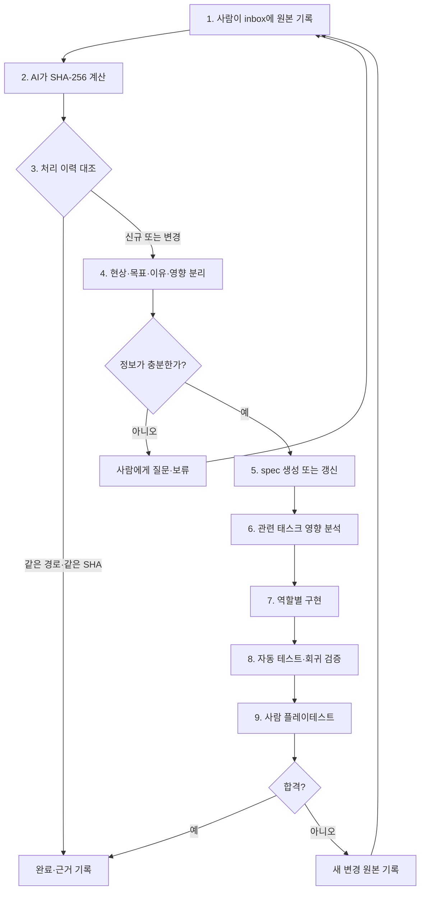
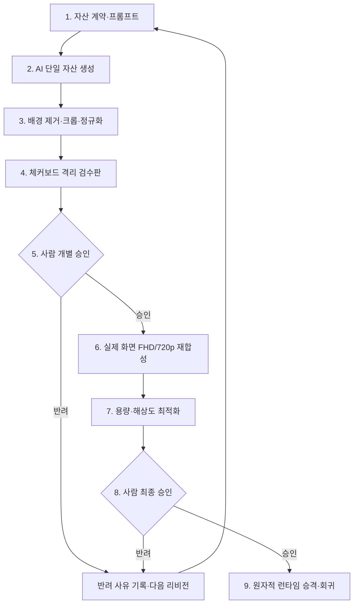

# YAKI SEASON AI 활용 기술 문서 V2

> NAN 2026 · NHN Game × AI Hackathon 사전 과제  
> 출품작: **YAKI SEASON(야키 시즌)**  
> 팀원: **권영민, 여정동**  
> 개발 기간: **2026-07-19 ~ 2026-08-10, 23일**  
> 문서 기준일: **2026-08-10**

---

## 0. 한 장 요약

### AI를 어디에 활용했는가

YAKI SEASON의 AI 활용은 크게 **2개 제작 파이프라인**으로 구성된다.

| 파이프라인 | 목적 | AI가 수행한 핵심 작업 | 사람이 책임진 판단 | 게임에 반영된 결과 |
|---|---|---|---|---|
| **A. 기획·개발 파이프라인** | 아이디어를 검증 가능한 게임 기능으로 전환 | 요구사항 구조화, 태스크 분해, 코드·데이터·테스트 작성, 회귀 분석 | 핵심 재미와 우선순위, 충돌 해결, 직접 플레이 합격 | 조립·굽기·생맥주·손님 운영·정산·저장·캠페인 |
| **B. 아트 생성·승격 파이프라인** | 생성 이미지를 추적 가능하고 안전한 런타임 자산으로 전환 | 프롬프트 구조화, 이미지 생성, 후처리, 검수판·재합성·메타데이터 생성 | 스타일 선택, 개별 승인, 실제 화면 최종 승인 | 배경·캐릭터·음식·스테이션·스토리 이미지 |

두 파이프라인 위에는 공통으로 적용되는 **AI 통제·검증층**이 있다.

- 저장소와 역할별 쓰기 범위 제한
- 원본·요구사항·결과물의 SHA-256 연결
- AI 8개 역할 분리와 작업 인계
- Vitest, Playwright, 스키마와 시각 레퍼런스 검증
- 사람만 가능한 승인과 플레이테스트
- 실패·반려·재시도 이력 보존

### 전체 구조



### 핵심 원칙

> AI가 결과물을 제안하고 제작 속도를 높이지만, 게임의 방향과 품질은 사람이 결정한다. AI가 만든 결과는 근거·자동 검증·사람 승인이 없으면 게임에 들어가지 않는다.

---

## 1. 프로젝트와 AI 활용 목표

YAKI SEASON은 할아버지의 야키토리 노포를 물려받아 꼬치를 직접 조립하고 숯불에 구우며 손님을 운영하는 웹 기반 타임 매니지먼트 게임이다. 두 명의 팀원이 23일 안에 기획, 코드, 데이터, 이야기, 아트와 QA를 동시에 진행해야 했다.

AI를 사용한 목표는 단순히 많은 코드를 생성하는 것이 아니었다.

1. 사람의 아이디어를 잃지 않으면서 구현 가능한 요구사항으로 바꾼다.
2. 두 명의 팀이 여러 전문 역할을 병렬로 수행할 수 있게 한다.
3. 생성 이미지의 출처와 승인 상태를 끝까지 추적한다.
4. 빠르게 만든 결과물이 실제 게임에서 깨지지 않도록 자동 검증한다.
5. AI의 추측, 과도한 수정과 허위 완료 보고를 구조적으로 제한한다.

### 프로젝트 규모

| 지표 | 2026-08-10 확인값 | 근거/비고 |
|---|---:|---|
| Git 저장소 | 3개 | `app`, `docs`, `art-workspace` |
| 총 커밋 | 281 | `app` 130 + `docs` 112 + `art-workspace` 39, 현재 `HEAD` 기준 |
| 팀원별 커밋 | 권영민 127, 여정동 154 | 세 저장소 합산 |
| 요구사항 | 18종 | 원본 DOCX 집계, 제출 커밋에서 재확인 필요 |
| 역할별 태스크 | 45개 | 원본 DOCX 집계, 최신 대시보드 재확인 필요 |
| 고정 시각 레퍼런스 | 36장 | SHA-256·viewport 검증 대상 |
| 테스트 | 원본 DOCX 기준 106파일 | 최종 제출 커밋에서 재집계 필요 |

> 숫자는 시점에 따라 변한다. 최종 제출본에는 제출 빌드의 Git SHA, `npm run verify` 실행 시각과 최신 테스트 수를 함께 기록한다.

---

## 2. 사용한 AI 도구와 적용 범위

NAN 2026 출품 약관의 주요 AI 도구 명칭과 활용 방식 고지 요구를 고려해 도구별 사용 범위를 구분한다.

| 도구 | 적용 파이프라인 | 활용 방식 | 대표 산출물 | 사람이 확인한 항목 |
|---|---|---|---|---|
| **Claude Code** | 기획·개발 | 요구사항 정리, 태스크 작성, 게임 로직·데이터·테스트·파이프라인 코드 작성 | `docs/spec`, `docs/epic`, `app/src`, `app/tests` | diff, 요구사항 정합성, 테스트 결과, 플레이 감각 |
| **OpenAI Codex** | 기획·개발, 아트 | 코드·문서 보조, 이미지 생성 작업 구성, 후처리·검증 실행 | 코드·문서 변경, 아트 작업 기록 | 변경 범위, 결과물, 파일 경로와 검증 결과 |
| **Codex 내장 imagegen / image_gen** | 아트 | 배경·캐릭터·음식·스테이션 이미지 생성 및 편집 | PNG 생성 원본과 리비전 | 스타일, 구도, 오류, 사용 승인 |
| **ChatGPT 이미지 생성 세션** | 아트 | 편차가 큰 캐릭터·자산을 한 장씩 생성 | 자산별 승인 후보 | 매 단계 개별 승인 또는 반려 |
| **Three.js GLTFExporter** | 아트 후처리 | 승인 이미지 기반 3D 자산화 | GLB, inspection 결과 | 외형, 노드, 삼각형 예산 |
| **Pillow / remove_chroma_key.py** | 아트 후처리 | 크로마키 제거, 크롭, 크기 정규화 | 투명 PNG·정규화 파일 | 가장자리, 배경 잔여, 피사체 손상 |
| **Vitest / Playwright** | 공통 검증 | 게임 규칙, 계약, FHD/720p 실제 브라우저 회귀 | 테스트 로그·화면 캡처 | 실패 재현과 실제 플레이 합격 |

### 모델 표기 확인 사항

원본 DOCX에는 Claude 세부 모델명이 `Opus 4.8 / Opus 4.8 1M / Opus 5`로 기록되어 있다. 최종 제출 시에는 실제 계정의 실행 이력과 서비스의 공식 모델명을 대조해 정확한 명칭으로 확정한다. 확인되지 않은 모델명은 추측해서 기재하지 않는다.

### 생성형 AI와 결정적 자동화의 구분

- 생성형 AI는 기획 후보, 코드 초안과 이미지 후보처럼 탐색이 필요한 일에 사용했다.
- 배경 제거, 파일 정규화, 3D 변환, 해시 계산, 스키마 검사와 테스트는 같은 입력에서 같은 결과가 나오는 고정 도구로 처리했다.
- 생성형 AI의 결과를 또 다른 AI의 주관적 평가만으로 승인하지 않았다. 최종 승인은 사람이 담당했다.

---

# 파이프라인 A. 기획·개발

## 3. 파이프라인 A 개요

### 목적

사람이 자유롭게 기록한 아이디어를 보존하면서, 구현 가능한 요구사항·역할별 작업·코드·테스트로 연결한다. AI가 아이디어를 임의로 확정하거나 구현 결과를 새로운 기획으로 덮어쓰는 것을 방지한다.

### 입력과 출력

| 구분 | 내용 |
|---|---|
| 입력 | 사람의 기획 메모, 변경 요청, 기존 spec·태스크, 실제 코드와 테스트 결과 |
| AI 작업 | 원본 분석, 모순 탐지, 요구사항 구조화, 영향 분석, 구현·테스트 작성 |
| 사람 작업 | 우선순위, 불명확한 요구의 답, 게임 규칙 확정, 직접 플레이 판정 |
| 출력 | 버전이 있는 spec·태스크, 코드·데이터·테스트, 검증과 인계 기록 |

### 흐름



## 4. 파이프라인 A의 단계별 작업

### A-1. 사람 원본 보존

사람은 떠오른 아이디어와 수정 요청을 `docs/inbox/`에 정제하지 않은 상태로 기록한다. AI는 이를 읽을 수 있지만 수정·이동·삭제하지 않는다.

**이유**

- AI의 요약 과정에서 원래 의도가 사라지는 것을 방지한다.
- 나중에 요구사항이 왜 생겼는지 확인할 수 있다.
- 사람이 원본을 고치면 해시가 달라져 새로운 입력으로 처리할 수 있다.

**산출물과 근거**

- `docs/inbox/0.idea/`: 게임 기획과 아이디어
- `docs/inbox/1.design/`: UX·밸런스·렌더링 설계 원본
- `docs/inbox/99.change-request/`: 구현 중 발견한 변경 요청

### A-2. SHA-256 기반 입력 식별

AI는 원본 경로와 SHA-256을 처리 이력과 대조한다.

| 판정 | 처리 |
|---|---|
| 같은 경로·같은 SHA | 이미 처리한 원본이므로 중복 작업하지 않음 |
| 같은 경로·다른 SHA | 사람이 수정한 새 입력으로 처리 |
| 새 경로 | 신규 요구 후보로 분석 |

요구사항 문서에는 근거가 된 원본 경로와 SHA-256을 남긴다. 대화 기억이 아니라 파일을 기준으로 다시 검증할 수 있다.

### A-3. 요구사항 구조화

AI는 원본을 다음 항목으로 나눈다.

- 현재 현상과 문제
- 사용자가 원하는 결과
- 그 결과가 필요한 이유
- 영향을 받는 게임 규칙·화면·데이터·아트·QA
- 포함 범위와 제외 범위
- 완료를 확인할 테스트
- 미해결 질문

정보가 부족하거나 서로 모순되면 AI가 임의로 결론내리지 않고 `질문 필요` 또는 `보류`로 남긴다.

### A-4. 태스크 영향 분석과 역할 배정

AI는 관련 spec을 참조하는 태스크를 모두 찾아 상태별로 처리한다.

| 기존 태스크 상태 | 처리 방식 |
|---|---|
| 대기 | 범위와 완료 기준 갱신 |
| 진행 중 | `변경 확인 필요`로 바꾸고 재작업 범위 기록 |
| 완료 | 과거 기록은 보존하고 후속 태스크 생성 |
| 관련 태스크 없음 | 담당 역할에 신규 태스크 생성 |

태스크에는 허용 쓰기 경로, 읽기 전용 입력과 SHA, 포함·제외 범위, 테스트, 사람 승인 지점, 생산자와 소비자를 기록한다.

### A-5. 역할별 AI 구현

개발 역할을 분리해 한 세션이 모든 파일을 동시에 바꾸지 않게 했다.

| 역할 | 담당 작업 | 대표 경로 |
|---|---|---|
| 개발자 1 | 게임 상태, 하루 영업, 조립·굽기·서빙, 저장·복구 | `app/src/domain/`, 게임 런타임 |
| 개발자 2 | 공개 shell, 화면·대사, 승인 아트 연결 | UI와 runtime binding |
| 개발자 3 | 콘텐츠·밸런스 데이터, JSON schema, 계약·회귀 도구 | `app/content/`, 검증 모듈 |
| PM | 의존관계, 승인 큐, 단계별 공개 gate | `docs/epic/pm-orchestration/` |
| 통합 QA | 재현, 회귀, 공개 전 차단 | `docs/epic/qa-release/`, 테스트 |

동시에 수행하는 작업은 쓰기 경로가 겹치지 않게 배치하고, 한 파일은 한 시점에 한 역할만 수정한다.

### A-6. 코드·데이터·테스트 동시 작성

AI가 기능 코드만 작성하고 끝내지 않도록 완료 기준에 테스트와 근거 기록을 포함했다.

대표 구현 결과:

- 네기마 재료 순서 조립
- 꼬치별 독립 앞면·뒷면 굽기, 뒤집기와 회수
- Three.js/GLSL 기반 연속 익힘 색 표현
- 생맥주 제조와 음식·음료 부분 제공
- 복수 손님·주문·대기·품질 반응과 좌석 정리
- 영업 마감, 정산과 다음 영업일 전환
- S0 프롤로그, D1~D3와 D4 예고 연결
- 캠페인 저장·복구
- 콘텐츠·밸런스 JSON, schema와 튜닝 도구

### A-7. 자동 검증

```text
npm run verify
  ├─ 런타임 에셋 파일·manifest·schema 검사
  ├─ 기준 이미지 36장 SHA-256·viewport 검사
  ├─ Vitest 단위·통합 테스트
  └─ Playwright Chromium FHD/720p E2E
```

테스트 결과에는 실행한 커밋 SHA와 dirty 상태를 함께 남긴다. 코드가 바뀌면 이전 테스트 결과를 현재 빌드의 통과 근거로 재사용하지 않는다. 간헐적 실패가 발생하면 최초 실패와 재시도 결과를 모두 기록한다.

### A-8. 사람 플레이테스트

자동 테스트가 모두 통과해도 사람이 직접 플레이하기 전에는 완료가 아니다.

사람이 확인하는 대표 gate:

1. 프롤로그가 의도한 감정과 흐름으로 보이는가
2. 첫 손님의 주문·조리·부분 제공·반응이 이해되는가
3. 하루 전체 영업과 정산이 중단 없이 이어지는가
4. 조작 타이밍과 피드백이 재미있고 납득 가능한가

불합격하면 AI가 현재 구현을 정답으로 확정하지 않고, 사람이 새 변경 원본을 기록해 파이프라인을 다시 시작한다.

## 5. 파이프라인 A 사례

### 사례: 네기마 2개를 독립적으로 굽는 첫 주문

| 단계 | 실제 작업 |
|---|---|
| 사람 결정 | 첫 손님 주문은 네기마 2개이며 시작 그릴 2칸에서 각각 굽는다 |
| AI 구조화 | 배치, 꼬치별 타이머, 앞·뒷면 상태, 회수와 구형 저장 복구 요구사항 분리 |
| 구현 | 두 꼬치의 배치·익힘·뒤집기·회수를 독립 상태로 작성 |
| 회귀 | 조기 뒤집기, 적정 품질, 회수, FHD/720p 흐름 검증 |
| 사람 확인 | 실제 화면에서 두 꼬치가 서로 간섭하지 않고 조작되는지 확인 |
| 근거 | app 커밋 `d437eaf`, 태스크 완료 기록의 단위 29/29·E2E 6/6 |

### 사례: AI 생성 코드를 그대로 믿지 않는 방식

그릴 이미지가 단계별 래스터 교체 방식으로 변경되었을 때 실제 플레이에서 색 변화가 부자연스러웠다. 이를 최종 상태로 인정하지 않고, 승인 원본 한 장에 셰이더로 익힘 색을 연속 적용하는 계약으로 되돌렸다. 구현 편의보다 사람에게 보이는 조리 감각을 우선한 사례다.

---

# 파이프라인 B. 아트 생성·승격

## 6. 파이프라인 B 개요

### 목적

생성형 AI가 만든 이미지를 곧바로 게임 폴더에 넣지 않고, 단일 자산 생성·후처리·독립 검수·실제 화면 검수·최종 승인·원자적 등록을 거쳐 추적 가능한 런타임 자산으로 만든다.

### 입력과 출력

| 구분 | 내용 |
|---|---|
| 입력 | 자체 아트 기준, 화면 계약, 자산별 대상·금지 조건, 참조 원본 |
| AI 작업 | 프롬프트 작성, 단일 자산 생성·편집, 검수판과 메타데이터 준비 |
| 고정 자동화 | 크로마키 제거, 크롭·정규화, 재합성, 최적화, 해시와 원자적 승격 |
| 사람 작업 | 개별 자산 승인, 실제 화면 최종 승인, 반려 사유 결정 |
| 출력 | 승인된 PNG/GLB, provenance, 검수·최적화 보고서, runtime handoff |

### 9단계 흐름



> 원본 문서에서는 생성부터 회귀까지를 9단계로 설명했다. 여기서는 가독성을 위해 계약과 생성, 후처리와 격리 검수를 각각 명시하면서도 동일한 승인 gate를 유지한다.

## 7. 파이프라인 B의 단계별 작업

### B-1. 자체 아트 기준 정의

특정 작가 이름을 모방하지 않고 `YS-HANDCRAFTED-NIGHT-v1`이라는 프로젝트 고유 기준을 사용했다.

- 연필 밑그림과 조금 불규칙한 잉크선
- 불투명 과슈 색면과 종이 질감
- 낡은 나무·황동·도자기 재질
- 형태를 설명하는 의도적인 픽셀 덩어리
- 따뜻한 호박색 작업등과 읽을 수 있는 남색 밤
- 광택이 강한 3D, 균일한 벡터선, 과도한 주황색 필터 금지
- 이미지 속 의미 있는 글자·숫자·가짜 일본어·워터마크 금지

글자와 실시간 수치는 HTML DOM UI가 담당한다. 내용이 바뀔 때 이미지를 다시 만들 필요가 없고 접근성과 자동 테스트도 유지할 수 있다.

### B-2. 프롬프트 1개 = 자산 1개

초기에는 전체 화면을 한 장으로 생성한 뒤 배경, 인물과 도구를 잘라 쓰려 했다. 그러나 잘린 경계와 원근이 맞지 않아 재작업이 반복됐다. 이후 한 프롬프트에서 한 자산만 생성하도록 바꿨다.

자산별 프롬프트는 다음 네 요소를 명시한다.

```text
[대상] exactly one coherent bite-sized raw chicken-thigh piece
[유지] source palette, marbling, cream-fat highlights, dark pixel contour
[금지] no skewers, other food, UI, scene, text, or shadow
[배경] uniform #00ff00 chroma-key background
```

반려 사유는 다음 리비전의 금지 조건으로 추가한다. 같은 오류를 반복하지 않기 위해 실패도 프롬프트 자산으로 축적한다.

### B-3. AI 이미지 생성

- 배경, 캐릭터, 음식, 스테이션과 이야기 장면을 imagegen 또는 ChatGPT 이미지 세션으로 생성했다.
- 결과 편차가 큰 캐릭터는 여러 장을 한꺼번에 만들지 않고 한 장 생성 후 한 번 승인하는 방식으로 진행했다.
- 생성 원본은 게임에서 직접 읽지 않으며 `art-workspace`에 보관한다.
- 사용 도구, 생성 모드와 프롬프트 요약을 provenance에 기록한다.

### B-4. 결정적 후처리

생성 이후에는 AI의 주관적 판단보다 고정 도구를 사용한다.

1. 평면 크로마키 배경 제거
2. 투명 가장자리와 색 번짐 정리
3. 피사체 여백 자르기
4. 규격 크기로 정규화
5. 필요 시 Three.js GLTFExporter로 GLB 변환
6. 이미지 크기·파일 용량·해시·삼각형 수 검사

같은 입력으로 결과를 재현할 수 있어야 검증과 회귀가 가능하다.

### B-5. 격리 검수와 사람 개별 승인

후보 자산을 체커보드 위에 단독으로 배치해 다음을 확인한다.

- 배경이 완전히 제거됐는가
- 피사체가 잘리거나 변형되지 않았는가
- 금지한 요소가 섞이지 않았는가
- 형태, 손, 도구와 음식 구조가 자연스러운가
- 자체 아트 기준과 색감이 일치하는가

AI는 검수판을 준비하고 확인 질문을 만들 수 있지만, 승인 여부를 대신 판단하거나 `approved-by-user`라고 기록할 수 없다.

### B-6. 실제 소비 화면 재합성

개별 이미지가 좋아 보여도 게임 화면에서 원근·크기·레이어와 UI가 충돌할 수 있다. 승인 후보를 실제 게임 카메라와 DOM 위에 놓고 두 해상도에서 확인한다.

- 1920×1080 FHD
- 1280×720
- 실제 배경·카운터·캐릭터·도구·UI와 합성
- 클릭 영역과 의미 UI 가림 여부 확인
- 화면별 안전 영역과 레이어 순서 확인

### B-7. 최적화와 최종 승인

화면 합성 후 용량과 해상도를 정리한다. 최적화 결과를 다시 실제 화면에 올리고 사람이 최종 승인한다. 개별 자산 승인과 소비 화면 최종 승인은 서로 다른 gate다.

### B-8. Provenance 기록

자산마다 `provenance.json`을 두어 다음 항목을 연결한다.

```text
게임의 런타임 파일
        ▲ manifest·승격 기록
runtime-handoff.json
        ▲ 모든 gate 통과
provenance.json
        ▲ 도구·프롬프트·후처리·승인·SHA-256
사람이 승인한 생성 원본과 참조 자료
        ▲
YS-HANDCRAFTED-NIGHT-v1
```

대표 기록 항목:

- 에셋 ID, 리비전과 화면 용도
- 생성 도구와 프롬프트 요약
- 참조 파일 경로와 SHA-256
- 후처리 도구와 파라미터
- 출력 파일의 규격, 용량과 SHA-256
- 포함하면 안 되는 요소 목록
- 사람 승인 날짜와 근거
- 다음 gate와 승인 질문

### B-9. 원자적 런타임 승격

검수용 파일을 사람이 직접 `app/public/assets`에 복사하지 않는다.

1. 모든 보고서와 해시를 검증한 finalizer가 `runtime-handoff.json` 생성
2. dry-run으로 대상, manifest 변경과 파일 해시 확인
3. 짧은 유효기간의 일회성 영수증 생성
4. 영수증을 사용해 파일과 manifest를 하나의 트랜잭션으로 반영
5. 하나라도 실패하면 파일과 manifest를 전부 원상 복구
6. 에셋 검증과 게임 회귀 테스트 실행

`runtimeRegistrationAllowed`는 기본값이 `false`이며 AI나 사람이 직접 `true`로 바꾸지 않는다. finalizer가 모든 선행 gate를 확인했을 때만 등록 가능한 handoff가 만들어진다.

## 8. 파이프라인 B 사례

### 사례: 네기마 익힘 표현

| 단계 | 실제 작업 |
|---|---|
| 계약 | 네기마 형태와 아트 원본은 유지하고 익힘 상태만 연속 변화 |
| 생성·승인 | 승인된 네기마 원본 확보 |
| 구현 | 하나의 원본 텍스처에 GLSL로 생것→익음 색 변화 적용 |
| 검증 | 셰이더 plane, 조리 타이밍과 회수 상태 테스트 |
| 사람 판단 | 단계 이미지 교체보다 연속 색 변화가 조리 감각에 적합하다고 확정 |
| 근거 | `89212f1`, `923cd73`, `3b57371` 등 app 커밋 |

### 사례: 전체 화면 생성 방식 폐기

한 장의 콘셉트 이미지를 잘라 여러 런타임 자산으로 쓰면 경계, 가려진 영역과 원근이 불안정했다. 이를 숨기지 않고 사용 중지 기록으로 남긴 뒤, 독립 자산 생성과 실제 화면 재합성 방식으로 전환했다. AI 활용 방식 자체를 실패 근거에 따라 개선한 사례다.

---

# 공통 통제·검증층

## 9. AI 8개 역할

| 역할 | 책임 | 하지 않는 일 |
|---|---|---|
| PM | 상태·의존성·우선순위·승인 큐·다음 작업 | 게임 코드와 아트 직접 제작 |
| 개발자 1 | 게임 규칙, 영업 흐름, 저장·복구 | 아트 승인과 manifest 직접 편집 |
| 개발자 2 | 화면·대사, 승인 아트의 상태별 연결 | 아티스트 원본 수정과 승인 대행 |
| 개발자 3 | 데이터·schema·계약·회귀 도구 | 화면 의미와 게임 규칙 임의 변경 |
| 아티스트 1 | 조립·그릴·음식 모델과 셰이더 | 다른 아티스트 영역과 런타임 등록 |
| 아티스트 2 | 가게 외관·소품·인물 초상 | 조리·드링크 영역 |
| 아티스트 3 | 드링크·서빙·정리·정산 아트 | 음식 셰이더 영역 |
| 통합 QA | 재현·분류·재검증·공개 gate | 의미 수정과 승인 대행 |

역할 시작 프롬프트는 `docs/terminal-guides/`에 저장한다. 새 세션은 이를 읽어 역할·경로·현재 상태를 복구한다.

## 10. 기록이 다를 때의 우선순위

1. 사용자가 가장 최근 확정한 지시
2. 현재 확정된 spec
3. 현재 담당 태스크
4. 전체 작업 현황 대시보드
5. 역할별 handoff
6. 실제 파일과 검증 결과
7. 과거 대화 기억

AI의 기억을 가장 낮게 두고, 실제 파일이 spec과 다를 때도 구현을 자동으로 정답으로 간주하지 않는다. 차이를 보고하고 사람이 처리할 때까지 의미를 바꾸지 않는다.

## 11. 금지한 행동과 방지 효과

| AI 금지 행동 | 방지하는 문제 |
|---|---|
| 과거 대화만으로 작업 재개 | 잃어버린 맥락을 지어내는 문제 |
| 사람이 쓴 원본 수정·이동·삭제 | 원래 의도와 증거 훼손 |
| 원본 메모를 검토 없이 spec으로 확정 | 아이디어가 검증 없이 구현되는 문제 |
| ID·문서 번호·승인 상태 추측 | 존재하지 않는 근거 생성 |
| 다른 역할의 dirty 파일 덮어쓰기 | 병렬 작업 유실 |
| `git reset`, `checkout`, `clean`으로 정리 | 사용자 작업 삭제 |
| manifest·등록 허용 플래그 직접 편집 | 승인 우회 |
| 검증하지 않은 결과를 완료 처리 | 허위 완료 보고 |
| 승인 대기 중 후보 무한 생성 | 비용과 검수 혼선 증가 |

## 12. 사람과 AI의 책임 경계

| AI가 할 수 있는 일 | 사람만 할 수 있는 일 |
|---|---|
| 요구사항 분석과 문서 초안 | 게임 방향과 우선순위 확정 |
| 코드·데이터·테스트 작성 | 충돌하는 요구사항의 최종 선택 |
| 이미지 후보와 검수판 생성 | 아트·시나리오 개별 및 최종 승인 |
| 자동 검증 실행과 결과 요약 | 직접 플레이하고 재미·감각 합격 판정 |
| 진행 상황과 근거 동기화 | 외부 제출, 공개와 원격 반영 결정 |

## 13. 실패·반려·충돌 처리

- 테스트가 간헐적으로 실패하면 최초 실패와 재시도를 모두 기록한다.
- 테스트 결과에는 커밋 SHA와 dirty 상태를 함께 기록한다.
- 사람이 반려한 이미지는 반려 사유와 재제출 금지를 기록한다.
- 다음 리비전은 이전 반려 사유를 금지 조건으로 상속한다.
- 에셋 승격 중 하나라도 실패하면 파일과 manifest를 모두 복구한다.
- 완료된 태스크의 과거 기록은 고치지 않고 후속 태스크를 만든다.

---

## 14. AI 활용이 실제 게임에 만든 결과

### 플레이 가능한 결과

- 시작 화면, 새 게임/이어하기와 프롤로그
- 네기마 순서 조립과 복수 꼬치 독립 조리
- 앞·뒷면 굽기, 뒤집기, 회수와 품질 판정
- 생맥주 제조와 음식·음료 부분 제공
- 복수 손님·주문, 대기, 반응과 좌석 정리
- 하루 영업 마감, 정산과 다음 날 전환
- D1~D3 캠페인과 D4 예고 기반
- 저장·복구와 콘텐츠·밸런스 데이터

### 제작 체계 결과

- 원본 SHA에서 spec·태스크까지 역추적 가능한 기획 기록
- 역할·경로가 분리된 8개 AI 에이전트 운영 체계
- 생성 아트의 provenance와 2회 사람 승인
- 실제 게임 화면 FHD/720p 재합성 검수
- 원자적 런타임 에셋 승격과 실패 복구
- 단위·통합·E2E·시각 레퍼런스 검증

### 개발 경과

| 기간 | 주요 결과 |
|---|---|
| 07-19 ~ 07-21 | 저장소와 AI 규칙 설계, 조립·굽기·서빙 첫 완주 |
| 07-19 ~ 07-25 | 요구사항 18종 구조화 |
| 07-23 | 데이터·밸런스 튜닝 도구와 schema 검증 |
| 07-26 ~ 07-28 | 자체 아트 기준과 생성·승인 파이프라인 구축 |
| 07-28 ~ 07-31 | 자산 생성·승인·등록과 회귀 테스트 확대 |
| 08-01 ~ 08-03 | D2·D3 영업일과 D4 예고 구현 |
| 08-04 ~ 08-10 | 승인 아트 통합, 독립 조리, 손님·서사·드링크 개선 |

---

## 15. 프롬프트와 작업 지시 자산

프롬프트는 채팅에만 남기지 않고 저장소에서 재사용 가능한 파일로 관리한다.

### 역할 시작 프롬프트 8종

- 역할과 하지 않는 일
- 허용 쓰기 경로
- 세 저장소·AGENTS·태스크 상태 확인
- 현재 diff·프로세스·승인 큐 복구
- 완료 증거와 보고 형식

### 작업 지시 템플릿

```text
runId / 우선순위 / 역할 / 필요한 이유
stage / 막고 있는 gate / epic과 버전
목표 / 허용 쓰기 경로 / 읽기 전용 입력과 SHA
선행 조건 / 포함 / 제외
완료 기준과 테스트
사람 승인·화면 gate
생산자 → 소비자
완료 후 다음 작업
보고: 변경 파일, artifact SHA, 테스트, blocker, handoff
```

### 프롬프트를 자산으로 관리한 효과

- 새 AI 세션이 이전 역할을 복구할 수 있다.
- 같은 자산을 동일한 계약으로 다시 만들 수 있다.
- 반려 사유를 다음 프롬프트에 누적할 수 있다.
- 무엇을 요청했고 무엇을 금지했는지 심사자가 확인할 수 있다.

---

## 16. 한계와 개선 계획

### 현재 한계

- 생성 이미지의 인물·손·원근은 편차가 커서 사람의 반복 검수가 필요하다.
- AI 에이전트가 많아지면 handoff와 문서 동기화 비용도 증가한다.
- 테스트 개수와 작업 현황 수치는 개발 중 계속 변하므로 제출 커밋에 고정해야 한다.
- 자동 테스트는 재미와 정서, 조작 손맛을 판정할 수 없다.
- 공개된 NAN 2026 안내에는 AI 활용 기술 문서의 상세 목차가 제시되지 않아, 주요 도구와 활용 방식뿐 아니라 과정·검증·책임·증거까지 자율적으로 구성했다.

### 본선에서의 개선 방향

1. 대회 주제 공개 후 게임 안에서 AI가 만드는 새로운 플레이 경험을 핵심 루프에 연결한다.
2. 반복되는 승인·반려 이유를 구조화해 자산 생성 성공률을 높인다.
3. 제출 빌드의 커밋·테스트·성능·라이선스 증거를 하나의 보고서로 고정한다.
4. 사람이 반드시 확인할 장면을 자동 캡처와 연결해 검수 시간을 줄인다.
5. AI가 만든 결과가 플레이어 경험을 어떻게 개선했는지 전후 비교로 측정한다.

---

## 17. NAN 2026 제출 요구 대응표

| 확인 항목 | 이 문서의 대응 위치 |
|---|---|
| AI를 활용한 게임 제작임을 설명 | 0장, 1장, 14장 |
| 주요 AI 도구 명칭 | 2장 |
| 각 도구의 활용 방식 | 2장, 파이프라인 A·B |
| AI가 수행한 구체 작업 | 4장, 7장 |
| 개발 과정과 실제 결과물 | 5장, 8장, 14장 |
| 사람과 AI의 역할 구분 | 9장, 12장 |
| 프롬프트·워크플로 설명 | 4장, 7장, 15장 |
| 검증, 안전장치와 실패 처리 | 10~13장 |
| 생성 아트의 출처와 승인 | 7장 provenance·승격 절차 |
| 재현 가능한 증빙 | 18장 근거 경로 |
| 한계와 향후 계획 | 16장 |

> NAN 2026 공식 안내에서 확인되는 사전 과제는 플레이 가능한 빌드, 시연 영상, 게임 소개서, AI 활용 기술 문서와 팀원 역할 기술서다. 이 문서는 그중 `AI 활용 기술 문서`이며, 빌드·영상·게임 설명·팀원 소개는 별도 제출물과 동일한 프로젝트명·팀원·커밋을 사용해야 한다.

---

## 18. 근거와 재현 경로

| 근거 | 저장 위치 |
|---|---|
| 저장소별 AI 작업 지침 | 각 저장소 `AGENTS.md` |
| 역할별 시작 프롬프트 | `docs/terminal-guides/` |
| 사람이 작성한 기획 원본 | `docs/inbox/` |
| 확정·초안 요구사항 | `docs/spec/` |
| 역할별 태스크와 상태 | `docs/epic/` |
| 게임 코드와 데이터 | `app/src/`, `app/content/` |
| 테스트 | `app/tests/` |
| 생성 원본·검수·반려·provenance | `art-workspace/` |
| 승인된 런타임 에셋 | `app/public/assets/` |
| 런타임 에셋 manifest | `app/public/assets/manifest.json` |

### 로컬 검증

```bash
cd app
npm install
npm run verify
```

검증은 에셋, 기준 이미지, Vitest와 Playwright를 순서대로 실행한다. 최종 제출본에는 다음 값을 채운다.

| 최종 제출 증거 | 값 |
|---|---|
| 제출 커밋 SHA | `[입력]` |
| 검증 실행 시각 | `[입력]` |
| 에셋 검증 | `[PASS/FAIL 및 개수]` |
| 기준 이미지 검증 | `[PASS/FAIL, 36장 여부]` |
| Vitest | `[통과/전체]` |
| Playwright FHD/720p | `[통과/전체]` |
| 사람 플레이테스트 | `[담당자·일시·결과]` |
| 플레이 빌드 URL | `[입력]` |
| 시연 영상 URL | `[입력]` |

---

## 19. 제출 전 최종 체크리스트

- [ ] 실제 사용한 AI 도구와 공식 모델명을 계정 이력으로 확인했다.
- [ ] 제출 커밋 SHA와 세 저장소 커밋 수를 고정했다.
- [ ] 제출 커밋에서 `npm run verify`를 다시 실행했다.
- [ ] 테스트 수, 요구사항 수와 태스크 수를 최신 값으로 교체했다.
- [ ] 이미지 생성 서비스의 이용 약관과 생성물 권리를 확인했다.
- [ ] 외부 폰트·음원·참조 이미지의 라이선스를 확인했다.
- [ ] provenance와 사람 승인 기록에서 개인정보·비밀값을 제거했다.
- [ ] 플레이 빌드, 영상, 게임 소개서, 팀 소개서가 같은 버전을 설명한다.
- [ ] Mermaid 흐름도를 PDF 또는 DOCX 제출 시 선명한 이미지로 렌더링했다.
- [ ] 사람만 수행한 판단을 AI가 수행한 것으로 과장하지 않았다.

---

## 결론

YAKI SEASON은 AI에게 게임 전체를 한 번에 맡긴 프로젝트가 아니다. 기획·개발과 아트 생성·승격이라는 두 파이프라인을 만들고, 그 위에 역할·경로·해시·테스트·사람 승인을 공통 통제층으로 배치했다.

이 구조를 통해 두 명의 팀원이 23일 동안 게임 규칙, 캠페인, 데이터, 아트와 QA를 병렬로 진행하면서도 다음 질문에 답할 수 있게 했다.

- 이 요구사항은 어떤 사람 원본에서 나왔는가?
- 이 코드와 그림은 어떤 AI와 프롬프트로 만들었는가?
- 누가 언제 승인했는가?
- 실제 게임 화면에서 검증했는가?
- 문제가 생기면 어느 단계로 돌아가야 하는가?

우리의 AI 활용 핵심은 **생성 자체가 아니라, 생성 결과를 사람이 책임질 수 있는 게임 제작물로 바꾸는 파이프라인**이다.
