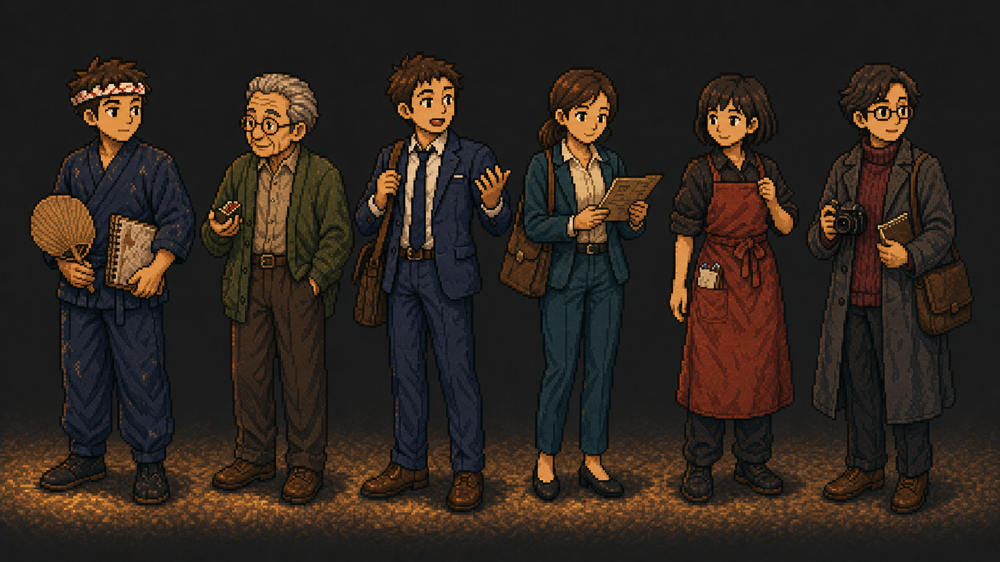
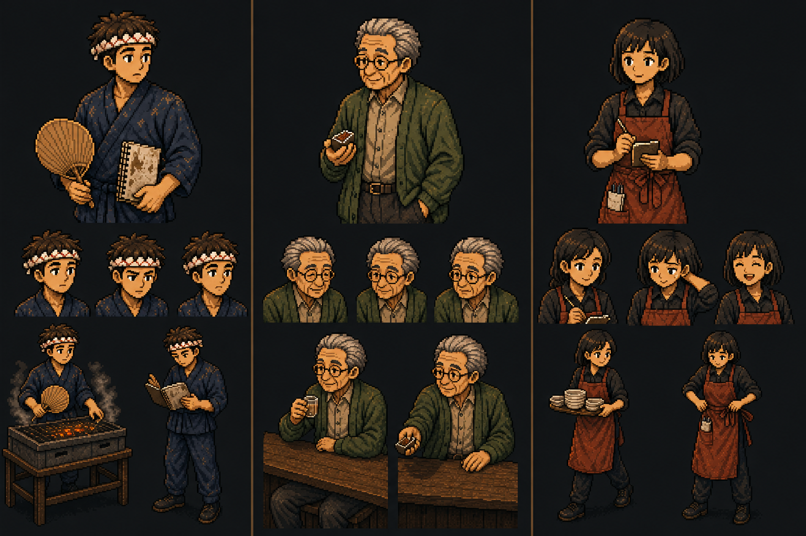

# YAKI SEASON 주요 등장인물 캐릭터 콘셉트 및 아트 기획 초안

- 생성일: 2026-07-20
- 생성 주체: 사용자 요청에 따라 AI가 작성
- 정제 상태: 미정제 아트 기획 초안
- 기준 시나리오: `inbox/0.idea/2026-07-20_스테이지별_시나리오_초안.md`
- 확정 여부: 이름, 연령, 색상값, 복장 변화와 제작 수량은 모두 검토 전 아이디어

> 이 문서는 `inbox`에 보관하는 원본 아트 기획 초안이다. 구현 기준이 아니며, 사용자가 별도로 지시하기 전까지 `spec` 또는 `epic`에 반영하지 않는다.

## 1. 생성 콘셉트 아트

### 1.1 메인 캐스트 전신 라인업



왼쪽부터 다음 순서다.

1. 주인공
2. 츠키오카
3. 직장인 A
4. 직장인 B
5. 하루
6. 카나모리

라인업은 인물별 기본 체형, 대표색, 고유 소품과 영업 외 기본 자세를 비교하기 위한 자료다. 머리 크기와 신체 비율은 실제 게임 내 좌석 캐릭터보다 상세하게 표현한 콘셉트 비율이며, 최종 스프라이트 제작 시 축소 테스트가 필요하다.

### 1.2 핵심 인물 표정·행동 시트



왼쪽부터 주인공, 츠키오카, 하루다.

- 상단: 대표 반신 초상
- 중단: 감정 변화용 표정
- 하단: 시나리오 핵심 행동
- 주인공: 부채질, 레시피 노트 확인
- 츠키오카: 카운터에 앉아 기다리기, 오래된 성냥갑 건네기
- 하루: 접시 정리, 주문 확인과 앞치마 정돈

## 2. 공통 캐릭터 아트 방향

### 2.1 시각 언어

- 성인 캐릭터는 약 `6~6.5등신`의 현실적인 비율을 기본으로 한다.
- 얼굴은 작은 해상도에서도 눈썹, 눈매, 입꼬리로 감정을 읽을 수 있게 단순화한다.
- 픽셀은 흐릿한 필터보다 명확한 덩어리와 제한된 색 단계로 표현한다.
- 인물의 밝은 면은 숯불의 따뜻한 황갈색, 그림자는 저녁의 남색과 자주색을 사용한다.
- 의상은 현대 일본 골목 상권에서 실제로 볼 수 있는 작업복·사무복·생활복을 바탕으로 한다.
- 판타지풍 장식, 과장된 일본 전통복, 과도하게 깨끗한 셰프 유니폼은 피한다.
- 모든 인물은 첫눈에 직업과 성격이 보이되 코스튬처럼 과장하지 않는다.

### 2.2 실루엣 차별화

| 인물 | 실루엣 키워드 | 상단 형태 | 하단 형태 | 한눈에 보이는 소품 |
|---|---|---|---|---|
| 주인공 | 각진 작업형 | 머리띠와 헝클어진 머리 | 넓은 작업 바지 | 부채, 레시피 노트 |
| 츠키오카 | 둥근 안정형 | 뒤로 넘긴 은발과 둥근 안경 | 곧게 떨어지는 슬랙스 | 성냥갑 |
| 직장인 A | 세로로 긴 활동형 | 헝클어진 짧은 머리 | 정장 바지와 업무 가방 | 느슨한 넥타이, 가방 |
| 직장인 B | 단정한 역삼각형 | 낮게 묶은 머리 | 발목이 보이는 정장 바지 | 메뉴, 숄더백 |
| 하루 | 짧고 빠른 작업형 | 둥근 단발 | 앞치마와 작업화 | 주문 패드, 펜 |
| 카나모리 | 긴 외투의 기둥형 | 사각 안경과 비대칭 가르마 | 무릎 아래 코트 | 카메라, 수첩 |

### 2.3 색상 분배

캐릭터마다 대표색은 다르지만 모든 색에 검댕과 나무 먼지가 섞인 듯 채도를 낮춘다.

| 역할 | 대표색 후보 | 보조색 | 숯불 하이라이트 | 피해야 할 색 사용 |
|---|---|---|---|---|
| 주인공 | 인디고 `#26354A` | 먹색 `#171C22` | 황토 `#C88945` | 선명한 로열 블루 |
| 츠키오카 | 이끼색 `#596044` | 회갈색 `#6D6255` | 부드러운 베이지 `#C7A77A` | 병약해 보이는 회백색 일변도 |
| 직장인 A | 네이비 `#29364B` | 백색 셔츠 `#D3C7B0` | 호박색 `#D8944A` | 주인공과 같은 작업복 인디고 면적 |
| 직장인 B | 딥 틸 `#284D50` | 크림 `#D7C7A7` | 구리색 `#B97848` | 하루의 적갈색 앞치마와 혼동 |
| 하루 | 녹슨 적색 `#8A3F2C` | 차콜 `#282B2C` | 밝은 주황 `#D17A3A` | 발랄한 원색 빨강 |
| 카나모리 | 버건디 `#5A2E32` | 석탄색 `#2B2A2B` | 황동 `#A77745` | 악역처럼 보이는 검정 단색 |

색상값은 콘셉트 이미지에서 추출한 근삿값이며 최종 팔레트 확정 전 테스트용이다.

### 2.4 얼굴과 표정 공통 원칙

- 눈을 크게 키워 귀여움을 강조하기보다 눈썹과 눈꺼풀 각도로 성인의 미묘한 감정을 표현한다.
- 입은 평상시 1~3픽셀 수준의 작은 변화로 두고, 웃음·당황·불만만 확실히 구분한다.
- 코와 볼의 숯불 하이라이트는 모든 인물에 같은 방향으로 적용한다.
- 놀람, 화남, 울음은 과장 기호보다 몸의 정지, 시선과 입 모양으로 표현한다.
- 술에 취한 붉은 얼굴은 현재 주요 인물에게 사용하지 않는다.
- 동일 인물의 초상, 좌석 스프라이트와 전신 컷에서 눈동자 색과 헤어 실루엣이 달라지지 않게 한다.

## 3. 인물 관계와 서사 대비

```text
전대 점주(할아버지)
        │ 가게·노트 상속
        ▼
     주인공 ───── 고용·협업 ───── 하루
       │                              │
       │ 첫 단골·과거의 기억         │ 현 세대의 동료
       ▼                              │
    츠키오카 ── 가게의 과거 증언 ────┘
       │
       │ 같은 카운터에서 자연스럽게 만남
       ▼
직장인 A·B ───── 입소문 ───── 카나모리
       │                          │
       └──── 현재의 생활 손님 ────┘
```

- 츠키오카는 과거를 대표하지만 변화에 반대하지 않는다.
- 하루는 미래를 대표하지만 전통을 가볍게 여기지 않는다.
- 직장인 A·B는 가게가 현재 사람들의 일상에 들어오는 과정을 보여준다.
- 카나모리는 외부 평가를 대표하지만 단순한 심판이나 악역이 아니다.
- 주인공은 이 네 관점을 받아들이면서 할아버지의 가게를 복제하지 않고 자신의 가게로 만든다.

## 4. 주인공

### 4.1 기본 설정

| 항목 | 초안 |
|---|---|
| 내부 호칭 | `OWNER` |
| 이름 후보 | 아사노 렌(浅野 蓮), 확정 전에는 대사에서 이름을 쓰지 않음 |
| 나이 | 27세 |
| 역할 | `とり暦`의 새 점주이자 플레이어 대리인 |
| 첫 등장 | S0, 꺼진 가게 문 앞 |
| 키·체형 | 약 173cm, 마른 편이지만 팔과 손에 작업 근육이 붙어 가는 체형 |
| 주 사용 손 | 기본 오른손, 접근성 옵션에서 도구 배치만 반전 가능 |
| 핵심 욕망 | 잠시 숨을 곳이 필요함 → 자신이 이어 갈 생활을 찾음 |
| 핵심 갈등 | 실패가 두려워 모든 일을 직접 통제하려 함 |
| 상징 소품 | 대나무 부채, 기름 얼룩진 레시피 노트 |
| 대표색 | 어두운 인디고와 숯 검정 |

### 4.2 얼굴과 머리

- 눈 아래에 아주 옅은 피로선을 둬 도시 생활의 피로를 암시한다.
- 눈매는 아래로 처지지 않고 수평에 가깝게 해 무기력보다 경계심을 표현한다.
- 머리는 짙은 밤색과 검정 사이. 앞머리가 일정하지 않고 왼쪽 위로 한 덩어리 튀어나온다.
- 머리띠는 할아버지가 쓰던 물건을 세탁해 다시 사용하는 설정 후보다.
- 흰 천에 작은 적갈색 무늬가 있지만 멀리서 피나 꽃처럼 보이지 않도록 추상 점무늬로 처리한다.
- 수염은 기본적으로 없고 D29 같은 피곤한 날에만 1픽셀 음영을 추가할 수 있다.

### 4.3 기본 복장

- 상의는 짙은 인디고 사무에 형태의 작업복. 오른쪽 여밈과 넓은 소매가 특징이다.
- 소매에는 완전히 지워지지 않은 작은 숯·타레 자국이 있다.
- 하의는 같은 계열의 넓은 작업 바지로, 무릎과 발목이 움직이기 쉬워야 한다.
- 신발은 미끄럼 방지 검정 작업화. 전통 게다나 짚신은 사용하지 않는다.
- 목에 수건을 상시 두르지 않는다. 하루와 실루엣이 겹치고 전형적인 요리사 이미지가 강해질 수 있다.

### 4.4 스테이지별 복장 변화

| 구간 | 변화 | 의미 |
|---|---|---|
| S0 | 회색 도시용 재킷, 검정 셔츠, 가벼운 여행 가방 | 아직 가게 밖 사람 |
| S1 | 할아버지의 인디고 작업복이 조금 큼 | 물려받은 역할에 아직 맞지 않음 |
| S2~S3 | 소매를 접고 허리끈을 조정 | 손에 익기 시작 |
| S4 | 노트용 작은 연필을 가슴 안쪽에 추가 | 손님의 취향을 기록 |
| S5 | 작업복 한쪽 소매를 하루가 꿰맨 흔적 | 혼자 운영하지 않음 |
| S6 | 자신이 고른 작은 황동 단추나 도구집 추가 | 복제가 아닌 개인화 |
| S7 | 기본 복장을 유지하되 가장 편안한 자세 | 성장 때문에 화려한 셰프복으로 바꾸지 않음 |

### 4.5 자세와 움직임

- 초반 기본 자세는 어깨가 약간 안쪽으로 말리고 팔꿈치가 몸에 가깝다.
- 주문이 몰리면 허둥대는 큰 동작보다 시선이 먼저 여러 스테이션으로 움직인다.
- 숙련될수록 보폭이 커지는 대신 동작 시작과 정지가 명확해지고 불필요한 왕복이 줄어든다.
- 부채질은 손목만 흔들지 않고 어깨와 허리를 낮춰 숯 쪽으로 힘을 보낸다.
- 노트를 읽을 때 얼굴을 가까이 대고 얼룩 사이 글자를 찾는 습관이 있다.
- 손님 말을 들을 때 조리 도구를 내려놓지 않더라도 시선을 잠깐 맞춘다.

### 4.6 필수 표정 세트

1. 기본 피로·경계
2. 주문 집중
3. 불 조절 중 긴장
4. 작은 실수 뒤 굳은 표정
5. 원인을 이해한 표정
6. 안도
7. 억제된 웃음
8. 손님 이야기를 듣는 진지함
9. 과부하 직전
10. 직원에게 일을 맡긴 뒤 어색함
11. D30 시작의 결심
12. 엔딩의 편안한 미소

### 4.7 필수 동작 세트

- 문 열쇠 넣기
- 노렌 걸기
- 숯 넣기와 부채질
- 꼬치 조립
- 꼬치 뒤집기
- 타레 바르기
- 생맥주 따르기
- 접시 서빙
- 좌석 정리
- 노트 펼치기·메모하기·덮기
- 직원에게 시범 보이기
- 영업 종료 후 그릴 불 낮추기

### 4.8 연출 금지

- 천재 요리사처럼 눈빛이 번쩍이거나 불꽃 오라가 생기는 연출.
- 매번 큰 땀방울과 비명으로 허둥대는 코미디.
- 성장 뒤 흰색 셰프 코트와 높은 모자로 완전히 교체.
- 술을 마시며 스트레스를 해소하는 주인공 묘사.
- 할아버지와 똑같은 얼굴·자세로 변해 개성을 잃는 결말.

## 5. 츠키오카

### 5.1 기본 설정

| 항목 | 초안 |
|---|---|
| 내부 호칭 | `REGULAR_TSUKIOKA` |
| 이름 후보 | 츠키오카 겐조(月岡 源三) |
| 나이 | 68세 |
| 역할 | 첫 손님, 할아버지의 옛 단골, 기억 주문의 중심 인물 |
| 첫 등장 | D1 첫 영업 |
| 키·체형 | 약 166cm, 마르고 약간 굽은 어깨 |
| 이전 직업 후보 | 동네 인쇄소 식자공 또는 교정 담당, 확정 필요 |
| 핵심 욕망 | 예전 가게의 복원이 아니라 다시 편하게 들를 저녁 자리를 원함 |
| 핵심 갈등 | 과거를 말하면 새 점주에게 짐이 될까 염려함 |
| 상징 소품 | 오래된 `とり暦` 성냥갑 |
| 대표색 | 이끼색, 회갈색, 바랜 황동 |

### 5.2 얼굴과 머리

- 뒤로 부드럽게 넘긴 은발. 관자놀이와 정수리는 밝지만 완전히 희지 않다.
- 둥근 금속 안경은 좌석 초상에서 가장 먼저 읽혀야 하는 특징이다.
- 눈썹은 길고 끝이 아래로 내려가지만 슬픈 인상보다 관찰하는 인상을 준다.
- 볼과 입 주변 주름은 웃을 때 더 잘 보이고 평상시에는 최소화한다.
- 코를 과장하거나 치아가 빠진 노인 캐리커처로 만들지 않는다.

### 5.3 복장

- 바랜 이끼색 카디건. 오래 입었지만 보풀과 늘어짐이 과도하지 않다.
- 안쪽은 따뜻한 회베이지 셔츠. 넥타이나 목도리는 기본 복장에서 제외한다.
- 짙은 갈색 슬랙스와 편안한 가죽 신발.
- 계절 변화가 필요하면 카디건 안쪽 셔츠 색과 얇은 코트 추가 정도로 제한한다.
- D30에도 새 정장을 입히지 않고 평소 옷으로 등장시켜 `특별한 날에도 평소처럼 오는 단골`이라는 인상을 유지한다.

### 5.4 자세와 습관

- 입장 뒤 항상 가게 전체를 한 번 보고 주인공에게 시선을 둔다.
- 평소 좌석에 앉을 때 한 손으로 의자를 살짝 확인한다.
- 주문할 때 손가락을 들지 않고 잔이나 메뉴 쪽으로 작은 손짓만 한다.
- 음식을 기다릴 때 조급하게 시계를 보지 않고 카운터의 작업을 관찰한다.
- 성냥갑을 건넬 때 손을 크게 뻗지 않고 카운터 위로 조용히 밀어 준다.
- 웃음은 입을 크게 벌리기보다 눈이 가늘어지고 입꼬리가 올라가는 방식이다.

### 5.5 필수 표정 세트

1. 첫날의 놀람
2. 조용한 관찰
3. 작은 만족
4. 장난기 있는 미소
5. 과거를 떠올리는 시선
6. 주인공을 걱정하는 표정
7. 기억 주문이 틀렸을 때의 부드러운 난처함
8. 바쁜 가게를 보는 뿌듯함
9. 할아버지의 실수를 말할 때의 익살
10. D29 마지막 페이지를 알려 주는 진지함

### 5.6 좌석 애니메이션 후보

- 안경을 한 번 올리기
- 잔의 물방울을 손가락으로 닦기
- 꼬치를 한 입 먹고 천천히 고개 끄덕이기
- 노트가 보이는 방향으로 시선 이동
- 주변 손님에게 자리를 조금 내주기
- 성냥갑을 주머니에서 꺼내기
- 계산 뒤 의자를 원위치에 두기

### 5.7 연출 금지

- 모든 문제의 정답을 알려 주는 현자 역할.
- 할아버지를 무조건 찬양하고 새 방식을 반대하는 보수적 노인.
- 술에 취해 얼굴이 붉어지고 말이 꼬이는 모습.
- 지팡이, 심한 떨림 등 시나리오에 필요 없는 노쇠 과장.
- 사망이나 중병을 감동 장치로 갑자기 추가.

## 6. 직장인 A

### 6.1 기본 설정

| 항목 | 초안 |
|---|---|
| 내부 호칭 | `OFFICE_A` |
| 이름 후보 | 사사키 료타(佐々木 亮太) |
| 나이 | 33세 |
| 역할 | D1 생맥주 주문, 입소문과 D30 예약을 이끄는 활동형 손님 |
| 키·체형 | 약 178cm, 보통 체격, 약간 앞으로 기운 자세 |
| 핵심 욕망 | 퇴근 뒤 생각을 멈출 수 있는 익숙한 자리를 찾음 |
| 핵심 갈등 | 빠르게 결정하지만 함께 온 사람의 속도를 놓칠 때가 있음 |
| 상징 소품 | 낡은 갈색 업무 가방, 느슨한 넥타이 |
| 대표색 | 네이비와 호박색 |

### 6.2 외형

- 짧고 약간 흐트러진 갈색 머리. 주인공보다 정돈됐지만 하루가 끝난 상태가 보여야 한다.
- 눈썹이 위로 올라가고 입이 먼저 웃는 열린 얼굴.
- 정장 재킷은 네이비, 셔츠는 크림빛 흰색, 넥타이는 짙은 남색.
- 오른쪽 소매만 한 번 접는 비대칭 습관으로 실루엣을 기억하기 쉽게 한다.
- 회사 로고, 사원증과 구체적 기업 표식은 사용하지 않는다.

### 6.3 행동과 표정

- 입장할 때 먼저 빈 좌석을 찾고 뒤의 B를 돌아본다.
- 주문은 손을 가볍게 들고 빠르게 말한다.
- 생맥주가 오면 잔을 크게 들어 올리기보다 어깨가 내려가며 안도한다.
- 말할 때 한 손을 자주 사용하고 웃을 때 몸이 약간 뒤로 젖는다.
- D30 예약 제안에서는 평소보다 손동작이 작아져 실제로 부담을 느끼는 모습을 보인다.

### 6.4 필수 표정

- 퇴근 직후 피로
- 가게 재개 발견
- 빠른 주문
- 생맥주를 받고 안도
- 동료를 재촉했다가 미안해함
- 입소문이 커져 뿌듯함
- D30 예약을 부탁하는 조심스러움
- 마지막 네기마를 먹는 만족

### 6.5 연출 금지

- 큰 소리와 술 강요를 반복하는 회식형 직장인.
- 넥타이를 머리에 두르는 취객 이미지.
- B의 주문을 무시하거나 성별 고정관념을 강화하는 대사.
- 직장 스트레스를 폭언이나 괴롭힘으로만 표현.

## 7. 직장인 B

### 7.1 기본 설정

| 항목 | 초안 |
|---|---|
| 내부 호칭 | `OFFICE_B` |
| 이름 후보 | 미즈노 미사키(水野 美咲) |
| 나이 | 31세 |
| 역할 | 첫 추가 주문, 메뉴 변화와 가게의 세부 성장을 알아보는 관찰형 손님 |
| 키·체형 | 약 164cm, 곧은 자세와 안정된 중심 |
| 핵심 욕망 | 사람의 말보다 세부 변화를 천천히 확인할 수 있는 장소를 선호 |
| 핵심 갈등 | 결정을 오래 고민해 A의 빠른 리듬에 휩쓸릴 때가 있음 |
| 상징 소품 | 단정한 갈색 숄더백, 작은 종이 메뉴 |
| 대표색 | 딥 틸과 크림 |

### 7.2 외형

- 짙은 밤색 머리를 목 아래에서 낮게 묶는다.
- 왼쪽 앞머리를 귀 뒤로 넘겨 얼굴 비대칭 특징을 만든다.
- 눈매는 주인공보다 둥글지만 입은 쉽게 웃지 않는 관찰형 표정.
- 딥 틸 재킷, 크림 블라우스, 같은 계열의 발목 길이 바지.
- 낮은 검정 구두와 중간 크기 숄더백으로 실용적인 출퇴근 복장을 만든다.

### 7.3 행동과 표정

- 주문 전에 메뉴판과 그릴을 번갈아 본다.
- 첫 입을 먹은 뒤 바로 말하지 않고 두 번째 입에서 반응한다.
- 가게의 좌석, 메뉴판, 화분처럼 작은 배경 변화를 가장 먼저 언급한다.
- A가 먼저 주문해도 자신의 주문은 별도로 말한다.
- D30 마지막 주문에서 첫날의 네기마를 기억해 시나리오를 닫는 역할을 맡는다.

### 7.4 필수 표정

- 메뉴 고민
- 예상보다 좋은 맛을 발견
- A의 성급함을 보는 익숙한 표정
- 새 메뉴를 추천받는 호기심
- 가게 변화 발견
- 혼자 방문했을 때의 차분함
- D30 마지막 주문의 회상

### 7.5 연출 금지

- A의 동반자나 연인으로만 취급.
- 술을 적게 마신다는 이유로 재미없는 사람처럼 묘사.
- 플레이팅만 중시하는 여성 손님 고정관념.
- 과도하게 세련되거나 고급스러운 패션으로 골목 가게와 거리감 생성.

## 8. 하루

### 8.1 기본 설정

| 항목 | 초안 |
|---|---|
| 내부 호칭 | `STAFF_HARU` |
| 이름 후보 | 고바야시 하루(小林 春) |
| 나이 | 22세 |
| 역할 | 첫 직원, 주인공이 책임을 나누게 만드는 현재 세대의 동료 |
| 첫 등장 | D18 시험 근무 후보 |
| 키·체형 | 약 158cm, 작은 체격과 낮은 무게중심 |
| 배경 후보 | 조리 전문학교 중퇴가 아니라 동네 대학생 또는 취업 준비생, 확정 필요 |
| 핵심 욕망 | 빠르게 움직이는 능력을 실제 기술로 인정받고 싶음 |
| 핵심 갈등 | 서두르면 확인을 생략해 작은 실수가 생김 |
| 상징 소품 | 주문 패드, 짧은 연필, 녹슨 적색 앞치마 |
| 대표색 | 적갈색과 차콜 |

### 8.2 얼굴과 머리

- 턱선에 닿는 짧은 검정 단발과 가벼운 앞머리.
- 머리 양옆이 작업 중 얼굴로 내려오지 않게 귀 뒤로 정리된다.
- 눈썹은 짧고 또렷하며 집중할 때 안쪽이 내려간다.
- 평소 입꼬리가 살짝 올라가 있지만 실수 뒤 웃음으로 얼버무리지 않는다.
- 주인공보다 얼굴 명암 대비를 높여 빠른 감정 변화를 읽기 쉽게 한다.

### 8.3 복장

- 차콜색 칼라 없는 작업 셔츠, 팔꿈치 아래까지 걷은 소매.
- 녹슨 적갈색의 긴 앞치마. 가슴 장식 없이 허리 매듭과 큰 오른쪽 포켓이 특징이다.
- 포켓에는 주문 패드, 연필과 작은 행주가 보인다.
- 하의는 검정 작업 바지, 신발은 발등을 덮는 미끄럼 방지화.
- 주인공과 다른 색, 다른 여밈, 다른 하의 실루엣을 유지한다.

### 8.4 스테이지별 변화

| 구간 | 변화 |
|---|---|
| D18 | 임시 검정 앞치마, 주문 패드를 손에 들고 다님 |
| D19~D21 | 적갈색 정식 앞치마, 패드를 포켓에 넣음 |
| S6 | 소매를 더 안정적으로 고정, 작은 도구집 추가 |
| D30 | 앞치마 매듭이 단정하고 동작 중 패드를 보지 않는 장면 증가 |

### 8.5 자세와 움직임

- 가만히 있을 때도 발끝이 다음 이동 방향을 향한다.
- 접시를 들 때 팔보다 몸 전체가 먼저 방향을 튼다.
- 실수한 순간 멈춰 얼어붙기보다 손이 잠깐 빨라졌다가 스스로 정지한다.
- 주문 확인 때 입으로 작게 순서를 되뇌는 습관이 있다.
- 주인공이 시범을 보일 때 몸을 가까이 들이밀지 않고 옆에서 같은 방향을 본다.
- 숙련 뒤에는 접시 정리와 주문 확인을 한 동선으로 연결한다.

### 8.6 필수 표정 세트

1. 첫 면접의 긴장
2. 배우려는 집중
3. 빠르게 해냈을 때의 기대
4. 주문을 헷갈린 직후 당황
5. 변명하지 않는 미안함
6. 시범을 이해한 순간
7. 자신감 있는 미소
8. 주인공의 과로를 걱정
9. D30 직전의 결의
10. 영업 종료 뒤 장난기

### 8.7 필수 동작 세트

- 앞치마 매기
- 주문 패드 확인
- 손님별 주문 반복 확인
- 접시 1개·2개·여러 개 정리
- 잔 닦기
- 완성 접시 전달
- 잘못 든 주문을 되돌려 놓기
- 주인공의 시범 따라 하기
- 영업 시작 전 작업대 닦기
- D30 종료 후 빈 잔 정리

### 8.8 연출 금지

- 활기찬 성격을 높은 톤, 큰 눈과 과도한 점프로만 표현.
- 실수를 반복해 플레이어를 방해하는 코믹 민폐 캐릭터.
- 주인공과의 로맨스를 기본 서사로 설정.
- 전문성 성장 대신 외형 꾸미기만 강조.
- 어린아이처럼 보이는 비율과 제스처.

## 9. 카나모리

### 9.1 기본 설정

| 항목 | 초안 |
|---|---|
| 내부 호칭 | `REVIEWER_KANAMORI` |
| 이름 후보 | 카나모리 시오리(金森 栞) |
| 나이 | 42세 |
| 성별 표현 | 중성적. 최종 성별·대명사 표현은 대사 원고에서 확정 |
| 역할 | 외부의 시선과 리뷰 시스템을 인격화하는 지역 음식 칼럼니스트 |
| 첫 등장 | D19 예고, D20 방문 후보 |
| 키·체형 | 약 169cm, 가늘고 곧은 자세 |
| 핵심 욕망 | 유명한 음식보다 동네에서 사라지는 가게의 이야기를 기록하고 싶음 |
| 핵심 갈등 | 관찰과 기록이 손님·점주에게 압박이 될 수 있음을 알고 있음 |
| 상징 소품 | 작은 카메라, 황동 링 수첩 |
| 대표색 | 버건디와 차콜 |

### 9.2 외형

- 턱 아래 길이의 짙은 갈색 머리, 오른쪽으로 깊게 탄 가르마.
- 사각 검정 안경과 차분한 눈매.
- 무릎 아래까지 오는 차콜 코트, 안쪽은 짙은 버건디 니트.
- 어깨에 작은 카메라 가방, 손에는 수첩 또는 소형 카메라 중 하나만 든다.
- 고가 장비를 과시하는 전문 촬영가보다 기록 습관이 있는 손님처럼 보이게 한다.

### 9.3 행동과 표정

- 음식이 오자마자 촬영하지 않고 먼저 점주에게 허락을 구하는 동작을 넣는다.
- 꼬치의 단면보다 가게 전체, 숯불과 손님의 거리도 관찰한다.
- 맛을 본 뒤 수첩에 즉시 점수를 쓰지 않고 몇 초 생각한다.
- 낮은 평가에서도 미간을 과하게 찌푸리거나 음식을 밀어내지 않는다.
- 리뷰 결과를 직접 읽어 주는 장면보다 다음 날 게시된 글로 반응을 보여준다.

### 9.4 필수 표정

- 조용한 인사
- 촬영 허락 질문
- 냄새를 확인하는 집중
- 예상과 다른 맛에 흥미
- 긴 기다림에 대한 객관적 아쉬움
- 점주의 이야기를 듣는 진지함
- 리뷰를 마친 뒤 작은 미소

### 9.5 연출 금지

- 선글라스, 과장된 카메라와 냉소적 미소로 악역화.
- Perfect가 아니면 분노하는 절대 심사위원.
- 팔로워 수와 영향력을 반복 자랑.
- 몰래 촬영하거나 손님 얼굴을 무단으로 게시하는 장면.
- 한 번의 리뷰로 가게 운명이 결정되는 과장.

## 10. 전대 점주, 할아버지

### 10.1 기본 설정

| 항목 | 초안 |
|---|---|
| 내부 호칭 | `GRANDFATHER_PREVIOUS_OWNER` |
| 이름 | 미정. 초반에는 이름보다 `전대 점주`의 흔적으로만 존재 |
| 이야기 역할 | 가게와 레시피 노트를 남긴 사람, 모든 인물 기억의 빈 중심 |
| 현재 상태 | 사망·은퇴·요양 중 어느 것인지 기존 시나리오에서 확정 필요 |
| 직접 등장 | 현재 초안에서는 현재 시점에 등장하지 않음 |
| 상징 소품 | 낡은 머리띠, 손때 묻은 집게, 레시피 노트 필체, 성냥갑 |

### 10.2 얼굴을 늦게 보여 주는 방향

- S0에서는 사진을 뒤집어 놓거나 얼굴 부분이 빛 반사로 가려진다.
- 손님의 회상은 얼굴보다 손, 등, 작업복 소매와 부채질 자세를 보여준다.
- 츠키오카는 웃는 사람으로, 직장인은 말 없는 사람으로 기억하는 등 서로 다른 인상을 남긴다.
- 후반에 사진을 공개하더라도 주인공과 똑같은 얼굴로 만들지 않는다.
- 직접적인 유령, 환영과 대화하는 장면은 현재 톤에서 제외한다.

### 10.3 외형 후보

- 70대 초반 당시의 모습: 짧은 은회색 머리, 굵은 눈썹, 넓고 거친 손.
- 주인공보다 밝게 바랜 남색 작업복과 진갈색 앞치마.
- 머리띠의 적갈색 점무늬는 주인공이 물려받은 것과 동일.
- 얼굴보다 손등의 작은 화상 흔적과 집게를 잡는 자세가 식별 요소다.

### 10.4 연출 금지

- 신비한 힘으로 노트를 복원하거나 결과를 알려 주는 유령.
- 모든 레시피를 완벽히 만든 전설적 장인.
- 현재 인물을 평가하는 내레이션 남발.
- 주인공이 할아버지의 동작을 그대로 재현해야만 성공하는 구조.

## 11. 캐릭터 조합별 화면 연출

### 11.1 주인공과 츠키오카

- 카운터를 사이에 두고 서로 정면보다 약간 비껴선 구도를 사용한다.
- 츠키오카가 말할 때 주인공은 손을 멈추지 않되 시선만 맞춘다.
- 감정 장면에서도 카메라가 얼굴만 크게 자르기보다 두 사람 사이의 빈 카운터와 숯불을 함께 보여준다.
- 성냥갑 전달은 손 클로즈업이 효과적이다.

### 11.2 직장인 A와 B

- 항상 똑같은 포즈로 붙여 놓지 않는다. A가 먼저 앉고 B가 메뉴를 보는 시차를 둔다.
- A의 네이비와 B의 틸은 나란히 있을 때 구분되도록 명도 차이를 둔다.
- 두 사람이 대화할 때 한쪽이 항상 리드하지 않고 주문 장면마다 시선을 교환한다.
- D30에는 다른 예약 손님 사이에서도 가방과 머리 실루엣으로 두 사람을 찾을 수 있어야 한다.

### 11.3 주인공과 하루

- 주인공은 세로로 안정된 동작, 하루는 낮고 빠른 가로 이동으로 대비한다.
- 교육 장면은 마주 보는 구도보다 나란히 같은 작업대를 보는 구도를 사용한다.
- 갈등 장면에서도 삿대질이나 팔짱보다 동선이 겹치거나 도구를 동시에 잡으려는 작은 행동으로 긴장을 표현한다.
- D30에는 서로 보지 않아도 다음 행동을 이어가는 동선으로 팀 성장을 보여준다.

### 11.4 주인공과 카나모리

- 카나모리의 카메라가 주인공 얼굴을 직접 겨누지 않게 한다.
- 첫 대화는 주인공이 카운터 안, 카나모리가 좌석에 앉은 일반 손님 구도로 유지한다.
- 평가 결과보다 허락을 구하고 기록하는 손동작을 먼저 보여준다.

## 12. 게임 내 표현 단위 초안

### 12.1 초상화

| 용도 | 권장 프레임 후보 | 필요한 변형 |
|---|---:|---|
| 영업 중 짧은 말풍선 | 96×96 또는 128×128 | 기본, 만족, 불만, 놀람 |
| 영업 전·후 대화 | 256×256 이상 | 표정 8~12종, 시선 좌우 |
| 단골 노트 | 128×160 | 정면 반신, 대표 소품 |
| 직원 관리 | 160×220 | 작업복 전신, 숙련 단계 |
| 리뷰 화면 | 128×128 | 카나모리 기본 초상, 리뷰 아이콘과 분리 |

해상도는 아트 생산성 검토 전 잠정값이다. 원본은 더 큰 캔버스로 제작하고 최근접 보간 축소 테스트를 거친다.

### 12.2 좌석 캐릭터 스프라이트

- 기본 착석
- 주문 시작
- 기다림 보통
- 기다림 임박
- 먹기
- 마시기
- 만족
- 취향 불일치
- 추가 주문
- 계산
- 퇴장 준비

손님마다 전체 애니메이션을 별도 제작하기보다 공통 몸 애니메이션에 고유 머리·상의·소품을 결합하는 방식을 검토할 수 있다. 다만 츠키오카의 성냥갑, A·B의 그룹 대화와 카나모리의 기록 동작은 고유 애니메이션이 필요하다.

### 12.3 직원 스프라이트

- 대기
- 좌우 이동
- 접시 집기·놓기
- 잔 집기·놓기
- 좌석 닦기
- 주문 확인
- 실수 인지
- 플레이어 시범 관찰
- 숙련 완료 반응

하루는 속도를 표현하기 위해 프레임 수를 줄여 튀게 만들기보다 준비 자세와 동작 사이 간격을 짧게 한다.

### 12.4 배경 속 등장

- S0 외관에는 캐릭터 실루엣을 최소화한다.
- S3부터 행인이 창문 안을 보는 작은 2D 루프를 추가한다.
- 주요 인물은 배경 군중으로 먼저 노출하지 않는다. 첫 입장 장면의 인지도를 보존한다.
- D30 단체 장면에서도 주요 인물의 머리와 대표색이 다른 손님에게 가려지지 않게 좌석을 배치한다.

## 13. 제작 우선순위 초안

### P0: 첫 영업일에 반드시 필요한 캐릭터

1. 주인공 반신 초상 6종
2. 주인공 조리 동작 핵심 5종
3. 츠키오카 착석·주문·먹기·퇴장
4. 츠키오카 초상 5종
5. 직장인 A·B 착석·주문·마시기·그룹 퇴장
6. 직장인 A·B 초상 각 3종

### P1: D7까지 필요한 확장

1. 주인공 숙련 자세 변형
2. 츠키오카 단골 표정·성냥갑 동작
3. A·B 재방문 대사 표정
4. 손님 공통 추가 주문·기다림 임박 애니메이션

### P2: D18 이후 필요한 확장

1. 하루 전체 직원 동작과 표정 10종
2. 카나모리 착석·촬영 허락·기록 동작
3. 주인공 교육·협업 동작
4. D30 주요 인물 회수 장면 포즈
5. 전대 점주의 손·등·사진 실루엣

## 14. 품질 확인 체크리스트

### 동일 인물 유지

- [ ] 초상과 전신에서 헤어 가르마, 안경과 얼굴형이 같은가?
- [ ] 좌우 반전 시 고유 특징이 무의미하게 바뀌지 않는가?
- [ ] 대표색이 숯불 조명 아래에서도 다른 인물과 구분되는가?
- [ ] 소품 없이도 실루엣만으로 인물을 구분할 수 있는가?
- [ ] 연령 차이가 주름 개수뿐 아니라 자세와 동작 속도로 보이는가?

### 게임 화면 가독성

- [ ] 카운터에 앉았을 때 머리와 주문 말풍선이 겹치지 않는가?
- [ ] 직장인 A·B가 같은 네이비 덩어리로 합쳐지지 않는가?
- [ ] 주인공과 하루의 작업복 색·여밈·머리 형태가 분명히 다른가?
- [ ] LOW 품질 모드에서도 안경, 머리띠, 앞치마가 식별되는가?
- [ ] 기다림 단계가 얼굴색 변화 없이 자세와 표정으로 구분되는가?

### 톤과 표현

- [ ] 손님을 유형의 풍자나 고정관념으로만 표현하지 않는가?
- [ ] 노인, 여성, 직장인과 리뷰어를 부정적 클리셰로 소비하지 않는가?
- [ ] 음주가 경쟁, 과음이나 성공의 상징으로 과장되지 않는가?
- [ ] 감정 장면이 과도한 눈물·플래시·광원 효과에 의존하지 않는가?
- [ ] 가게 성장 뒤에도 낡고 따뜻한 생활감이 유지되는가?

## 15. 추가로 필요한 아트 탐색

1. 주인공 S0 도시복과 S1 작업복 비교 시트.
2. 직장인 A·B의 착석 자세, 그룹 대화와 D30 변형 시트.
3. 카나모리의 촬영 허락·맛보기·기록 순서 시트.
4. 전대 점주의 손, 등, 사진과 소품만으로 존재감을 만드는 회상 시트.
5. 모든 인물의 카운터 착석 높이·말풍선 안전 영역 비교.
6. 모바일 화면에서 96px 이하로 축소했을 때 헤어·안경·앞치마 식별 테스트.
7. 숯불 강도에 따른 피부색과 의상색 변화 팔레트.
8. D30 단체 장면에서 주요 인물과 일반 손님을 섞은 좌석 배치.

## 16. 미확정 질문

1. 주인공의 이름·성별·외형을 고정할지 선택형으로 둘지.
2. 츠키오카의 전체 이름과 이전 직업을 확정할지.
3. 직장인 A·B의 관계를 같은 팀 동료로 확정할지.
4. 하루의 배경을 대학생, 취업 준비생 또는 조리 경험자로 둘지.
5. 카나모리의 성별 표현과 리뷰 매체를 어떻게 설정할지.
6. 할아버지의 현재 상태와 얼굴 공개 시점을 언제로 둘지.
7. S0 도시복을 실제 플레이 화면에 별도 제작할 가치가 있는지.
8. 캐릭터 초상화를 픽셀 원화로 직접 그릴지 고해상도 원화를 픽셀화할지.
9. 좌석 캐릭터를 2D 스프라이트로 유지할지 일부 3D 리깅을 사용할지.
10. 계절 변화에 따라 외투·소매·색상을 어느 정도 바꿀지.

## 17. 이미지 생성 기록

- 생성 방식: Codex 내장 이미지 생성 도구
- 스타일 참조: `13_art_style_guide.png`, `04_order_and_customer_types.png`, `12_regular_customer_story.png`, `16_first_business_day_storyboard.png`
- 정체성 기준: `18_main_cast_character_lineup.png`
- 픽셀화 보정: 기존 아트와 맞추기 위해 저해상도 원본을 4배 최근접 확대한 형태의 굵은 픽셀 군집, 계단형 윤곽, 제한 팔레트와 무안티앨리어싱 기준으로 두 이미지를 재생성함
- 채택 이미지:
  - `18_main_cast_character_lineup.png`
  - `19_key_character_acting_sheet.png`
- 제외 결과: 최초 핵심 인물 연기 시트는 주인공·하루의 복장이 직장인 캐릭터와 섞여 정체성 유지에 실패해 저장소에 포함하지 않음
